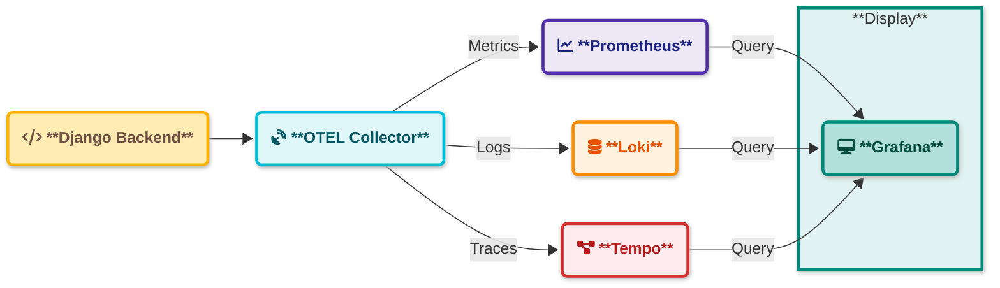

# Monitoring System Documentation

## Overview
This monitoring system is designed to collect, process, and visualize metrics from various system components. It provides real-time monitoring, alerting, and historical data analysis capabilities.

## Architecture



### Data Flow
1. Django Backend generates telemetry data
2. OpenTelemetry Collector receives:
   - Metrics (OTLP format)
   - Traces (OTLP format)
   - Logs (OTLP format)
3. Data Distribution:
   - Prometheus scrapes metrics from OTel Collector
   - Tempo receives distributed traces
   - Loki ingests log streams
4. Grafana provides unified view:
   - Metrics visualization from Prometheus
   - Trace analysis from Tempo
   - Log exploration from Loki


## Quick Start

1. Clone the repository:
Required *Docker* and *just*
```bash
git clone https://github.com/PrantaChakraborty/OTEL-monitoring.git
```

2. Start all services:
```bash
just start-all
```


3. Access the dashboard:
- Open `http://localhost:3000`
- Login with default credentials 
- Username: admin
- Password: admin

4. Stop all services:
```bash
just stop-all
```

## Backend Configuration
Your backend(Django) needs to send data to the otel collector
otel url is : http://localhost:55690
```bash
    OTEL_RESOURCE_ATTRIBUTES=service.name=satarko \
    OTEL_EXPORTER_OTLP_ENDPOINT="http://localhost:55690" \
    OTEL_EXPORTER_OTLP_PROTOCOL=grpc \
    opentelemetry-instrument gunicorn zicore_connect.wsgi:application --workers 2
```

## Project Structure

```
monitoring/
├── docker-compose.yml
├── dashboard/
│   └── loki.json
├── loki/
│   ├── loki-config.yaml
├── prometheus/
│   └── prometheus.yml
├── tempo/
│   └── tempo.yml
otel-collector/
├── docker-compose.yml
└── otel_config.yaml
```

# Project Structure Documentation

## monitoring/
Main monitoring stack directory containing configuration files for observability tools.

### monitoring/docker-compose.yml
Docker Compose configuration for setting up the monitoring stack services.

### monitoring/dashboard/loki.json 
Grafana dashboard configuration file for Loki logs visualization.

### monitoring/loki/loki-config.yaml
Configuration file for Loki log aggregation system.

### monitoring/prometheus/prometheus.yml
Prometheus configuration file defining scrape targets and metrics collection.

### monitoring/tempo/tempo.yml
Configuration file for Tempo distributed tracing backend.

## otel-collector/
OpenTelemetry Collector configuration directory.

### otel-collector/docker-compose.yml
Docker Compose file for OpenTelemetry Collector deployment.

### otel-collector/otel_config.yaml
OpenTelemetry Collector configuration defining data collection and export pipelines.


