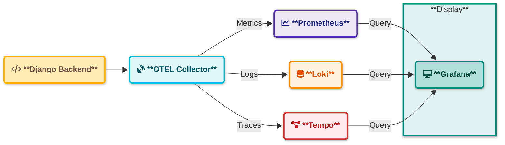

# Monitoring System Documentation

## Overview
This monitoring system is designed to collect, process, and visualize metrics from various system components. It provides real-time monitoring, alerting, and historical data analysis capabilities.

## Architecture



### Data Flow
1. Django Backend generates telemetry data
2. OpenTelemetry Collector receives:
   - Metrics (OTLP format)
   - Traces (OTLP format)
   - Logs (OTLP format)
3. Data Distribution:
   - Prometheus scrapes metrics from OTel Collector
   - Tempo receives distributed traces
   - Loki ingests log streams
4. Grafana provides unified view:
   - Metrics visualization from Prometheus
   - Trace analysis from Tempo
   - Log exploration from Loki

## Components

### 1. Data Collectors
- **System Metrics Collector**
  - Collects CPU, Memory, Disk usage
  - Start: `systemctl start metrics-collector`
  - Config: `/etc/metrics/collector.conf`

- **Application Logs Collector**
  - Collects application-specific logs
  - Start: `systemctl start log-collector`
  - Config: `/etc/logs/collector.conf`

### 2. Processing Engine
- Handles data aggregation and processing
- Start: `systemctl start process-engine`
- Config: `/etc/process-engine/config.yaml`

### 3. Time Series Database
- Stores all metrics and logs
- Default port: 8086
- Start: `systemctl start tsdb`
- Web UI: `http://localhost:8086`

### 4. Visualization Dashboard
- Real-time metrics visualization
- Access: `http://localhost:3000`
- Default credentials:
  - Username: admin
  - Password: admin

### 5. Alert Manager
- Handles alert rules and notifications
- Config: `/etc/alertmanager/rules.yaml`
- Web UI: `http://localhost:9093`

## Quick Start

1. Clone the repository:
```bash
git clone https://github.com/your-org/monitoring
```

2. Start all services:
```bash
just start-all
```

3. Access the dashboard:
- Open `http://localhost:3000`
- Login with default credentials

4. Stop all services:
```bash
just stop-all
```

## Configuration

Detailed configuration files are located in `/etc/monitoring/`:
- `collectors.yaml`: Data collection settings
- `processing.yaml`: Data processing rules
- `alerts.yaml`: Alert definitions
- `visualization.yaml`: Dashboard configurations

## Troubleshooting

Check service status:
```bash
systemctl status monitoring-stack
```

View logs:
```bash
journalctl -u monitoring-stack
```

## Support
For issues and support, please create an issue in the repository.
